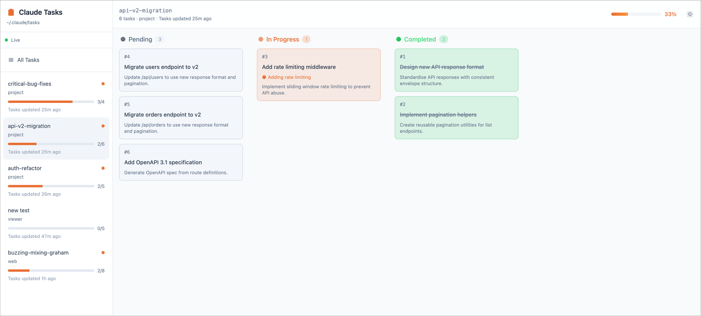
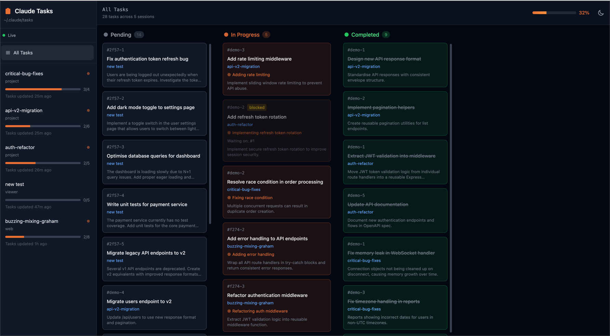

# Claude Task Viewer

A web-based Kanban board for viewing Claude Code tasks. Watch your tasks update in real-time as Claude works.





## Installation

### Quick start (npx)

```bash
npx claude-task-viewer
```

Then open http://localhost:3456

### From source

```bash
git clone https://github.com/L1AD/claude-task-viewer.git
cd claude-task-viewer
npm install
npm start
```

## Features

- **Kanban board** — Tasks organised in Pending, In Progress, and Completed columns
- **Live updates** — See tasks change status in real-time via SSE
- **Session browser** — View all your Claude Code sessions
- **Session names** — Shows custom names (from `/rename`), or the auto-generated slug
- **All Tasks view** — Aggregate tasks across all sessions
- **Task details** — Click any task to see full description with markdown rendering
- **Progress tracking** — Visual progress bars and completion percentages
- **Dependency tracking** — See which tasks block others

## How it works

Claude Code stores tasks in `~/.claude/tasks/`. Each session gets its own folder containing JSON files for each task.

```
~/.claude/tasks/
  └── {session-uuid}/
      ├── 1.json
      ├── 2.json
      └── ...
```

The viewer watches this directory and updates the UI in real-time.

## Task structure

```json
{
  "id": "1",
  "subject": "Task title",
  "description": "Detailed markdown description",
  "activeForm": "Present tense status shown while in progress",
  "status": "pending | in_progress | completed",
  "blocks": ["task-ids-this-blocks"],
  "blockedBy": ["task-ids-blocking-this"]
}
```

## Configuration

### Custom port

```bash
PORT=8080 npx claude-task-viewer
```

### Open browser automatically

```bash
npx claude-task-viewer --open
```

## API

The viewer exposes a simple API:

| Endpoint | Description |
|----------|-------------|
| `GET /api/sessions` | List all sessions with task counts |
| `GET /api/sessions/:id` | Get all tasks for a session |
| `GET /api/tasks/all` | Get all tasks across all sessions |
| `GET /api/events` | SSE stream for live updates |

## Roadmap

We're building deeper integrations with Claude Code:

- **Shared task lists** — Support for `CLAUDE_CODE_TASK_LIST_ID` to view tasks shared across multiple sessions and subagents
- **Task creation** — Create tasks directly from the viewer that Claude Code will pick up
- **CLI commands** — `claude-task-viewer add "Fix the bug"` to create tasks from your terminal
- **Desktop notifications** — Get notified when tasks complete or become unblocked
- **Export to Linear/GitHub** — Push tasks to your existing project management tools

Have ideas? [Open an issue](https://github.com/L1AD/claude-task-viewer/issues).

## License

MIT
